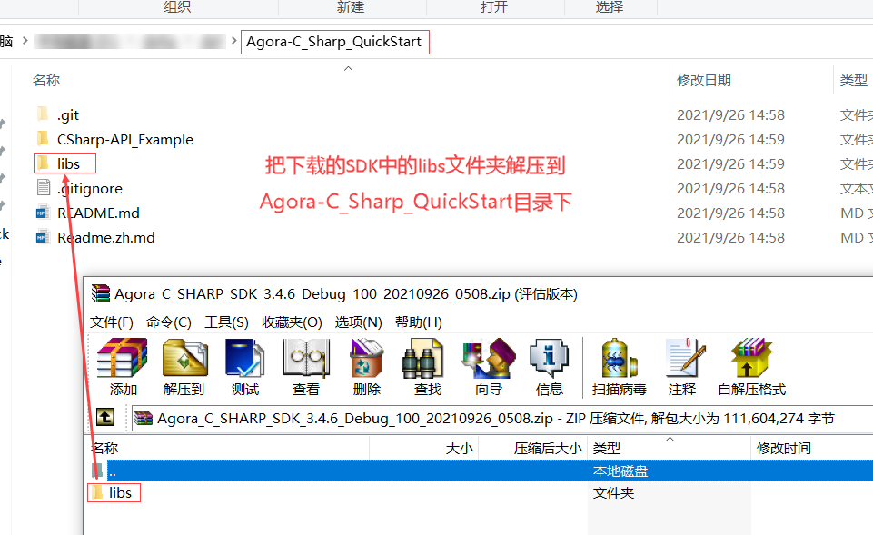

# Agora C# SDK
*[中文](Readme.zh.md) | English*

The API example of [Agora RTC C# SDK](https://github.com/AgoraIO-Community/Agora-C_Sharp-SDK/tree/dev/3.4.6)! 

## Prerequisites

- Visual Studio 2019+ with C++ (Windows)
- .NET

## Usage

1. Clone the repository.

	```bash
	git clone https://github.com/AgoraIO-Community/Agora-C_Sharp_QuickStart.git
	```

2. Download required SDK.
    
	Open `Agora-C_Sharp_QuickStart/CSharp-API_Example/CSharp-API_Example.sln` via Visual Studio 2019. select x64 platform.

	Download SDK [Agora Video SDK for Windows](https://download.agora.io/sdk/release/Agora_C_SHARP_SDK_3.4.6_Debug_100_20210926_0508.zip). Unzip the downloaded SDK package to Agora-C_Sharp_QuickStart directory.

   
3. Build and Run

    Build CSharp-API_Example Project and Run. After input [valid](https://docs.agora.io/cn/Video/API%20Reference/cpp/classagora_1_1rtc_1_1_i_rtc_engine.html#adc937172e59bd2695ea171553a88188c) App ID and Channel ID (seperate with ; if have more) in UI window, click "update Id" button to save it. if so, there is no need to input again when app restart.
	
	Have fun!

*If you do not have an App ID, see Appendix.*

## Help

For more information about our API, please refer to [Agora C++ API](https://docs.agora.io/en/Video/API%20Reference/cpp/v3.1.2/index.html).

*C# API reference is on proceeding while C++ API is similar.*

## Appendix

### Create an Account and Obtain an App ID

To use our SDK, you must obtain an app ID: 

1. Create a developer account at [agora.io](https://dashboard.agora.io/signin/). Once you finish the sign-up process, you are redirected to the dashboard.
2. Navigate in the dashboard tree on the left to **Projects** > **Project List**.
3. Copy the app ID that you obtained from the dashboard into a text file. You will use it when you run demo (there is an input box in our GUI demo).
